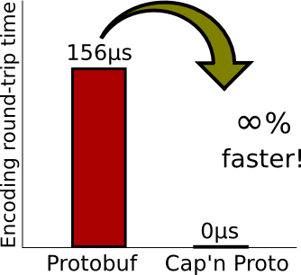

# 可行性报告

## 1 将rain部署到raspbian

### 1.1 项目介绍

本项目旨在将[Rain](https://github.com/substantic/rain)（一个开源的Rust语言编写的分布式计算框架）从Linux系统移植到raspbian系统上，使树莓派成为分布式计算节点，能够接收、执行和返回服务器分发的计算任务；缩减和优化Rain代码，使其更加轻量、快速，并且能够长期在树莓派的后台运行，不影响其他运行在树莓派上的程序，以此实现对以树莓派为代表的物联网设备的闲置算力的有效利用。如果时间允许，还将尝试对Rain进行裸机编程的改造，提高Rain的运行速度，同时使Rain适用于更多物联网设备。

目前，经过初步的尝试，分布式的计算框架rain已经可以被移植到raspbian上并且正常运行。我们小组打算在目前工作上更进一步，在现有框架上进行易用性，高效性与普适性等方面的改造。目前我们计划的工作如下。我们对每个具体工作进行了可行性调研，并根据具体实施难度与实际意义选择其中一部分尝试实现。

+ 尝试将rain部署在安卓设备上。
+ 将rain部署于树莓派裸机上。
+ 改进rain的调度算法
+ 对rain的通讯方式进行改造

### 1.2 将rain部署于raspbian

#### 1.2.1 rain的主要特点
rain是一个分布式计算框架。在表层上，其主要由两个部分组成：一个叫rain的一体化静态链接二进制文件，和一个用于调用rain服务的仅限python的库。

在底层上，rain的二进制文件包含了server，executor与governor三个主要组成部分。其中：

+ server是服务器节点，用于与其他计算节点通信，管理其余计算节点，并进行任务分配与调度，收集计算结果。
+ governor是计算节点的调控管理者，用于与服务器节点通信，接收服务器节点分配的任务与数据，生成executor执行这些任务，并将结果返回给服务器节点。
+ executor是在计算节点由governor生成的用于执行计算任务的部分。rain中内置了部分简单的executor用于简单测试功能（如将两个字符串合并），也支持使用python的通用executor，还提供了rust与c的库，以方便用户编写自己的专用executor。

由于rain将服务器功能与计算节点功能融合进了一个二进制文件中，则目标机器是服务器还是计算节点取决于如何执行rain。执行

    rain start --simple

会将server与governor都部署于本地机器上。执行

     rain start -S --governor-host-file=my_hosts

会将server部署于本地，从my_hosts文件中读取计算节点信息，并使用ssh连接计算节点。执行

    rain governor <SERVER-ADDRESS>

会在本机上启动一个计算节点。它将尝试与server通信，从而接收数据与计算任务。

由于rain本身一体化的设置与便于使用的特性，对其进行直接移植的便利性大大增强。只需将rain编译为能在arm架构树莓派上运行的一个一体化二进制文件就能实现大部分工作。

#### 1.2.2 rust的主要特点
Rust是一种系统编程语言，专注于三个目标：安全性、速度和并发性。Rust同样类似于C，是一种静态的强类型系统编程语言，但解决了c广为诟病的安全性问题。

rust还具有以下特点，方便了rain的移植工作：

+ rustup
  官方提供了一个管理 Rust 版本和相关工具的命令行工具rustup，它方便地为我们提供版本稳定且统一的rust开发工具。

+ cargo
  Cargo 是 Rust 的构建系统和包管理器。使用cargo来管理 Rust 项目十分容易，它替代了make在大型c项目的作用，同时又不需要编写繁复的类似makefile文件来进行代码构建与项目生成。
  
  cargo利用工程目录下的Cargo.toml文件信息来构建项目。Cargo.toml 包含了各类杂项信息如作者，时间，版本等，同时也包含项目构建所必需的信息，如所需的库和依赖。

  在Cargo.toml 中指定所需的库时需要显式地指定库的版本。当搭建项目时发现本地缺乏库或版本不一致时，cargo会自动从官方地址下载获取对应所需的库，而不需手动添加。这使得项目的编译搭建与项目的移植变得容易。同时使用 Cargo 的一个额外的优点是，不管你使用什么操作系统，其命令都是一样的，为跨平台的工作带来便利。

+ 多平台支持
  rust编译支持众多[平台](https://forge.rust-lang.org/platform-support.html)，其中不乏树莓派。rust为跨平台编译也提供了工具链。构建项目时使用target=armv7-unknown-linux-gnueabihf，并配合树莓派官方交叉编译工具链，便可以方便地构建raspbian上运行所需要的格式。

由于rain主要是由rust搭建而成，以上特点使得rain的移植更为便利。

#### 1.2.3 搭建与部署过程简述

由于rain项目的搭建除了需要Cargo.toml中指定的依赖外还需要SQLite3，则rain迁移到树莓派主要分为以下两步：
+ SQLite3在arm架构下的交叉编译与库生成
+ rain的交叉编译与生成

##### 1.2.3.1 SQLite3
从官方获取 sqlite3源码，使用以下指令配置交叉编译信息

    ./configure --host=arm-linux --prefix=$INSTALL_PATH CC=arm-linux-gnueabihf-

并使用make编译，然后使用make install安装到指定路径。

将安装路径中lib文件夹中的库文件libsqlite3.a，libsqlite3.so等复制到交叉编译工具链目录下的lib文件夹中，即完成了适合树莓派使用的SQLite3库的编译与安装。

##### 1.2.3.2 rain
利用git获取rain源码，直接使用cargo构建项目

    cargo build --release target=armv7-unknown-linux-gnueabihf

此时cargo会自动下载交叉编译所需额外工具，然后开始编译。若未将sqlite3相关库文件添加，则会在编译时出现以下错误

    ld: can not find lsqlite3

若正确地添加了适用于树莓派的sqlite3库，则编译将顺利进行，二进制文件被至于target文件夹中。

#### 1.2.4 尝试部署运行
将生成的二进制文件置于树莓派中运行。

rain能顺利运行。则rain可以较容易地被部署于树莓派上，并利用树莓派作为计算节点参与计算贡献算力。

## 2 裸机编程

考虑到许多物联网设备没有操作系统，或者只有为某些程序定制的操作系统，Rain不能运行在这些设备上，所以我们想把Rain改成裸机程序，使它的运行不依赖于操作系统。

由于Rain是用Rust写的，而Rust语言写的程序编译后可以直接在裸机运行，因此适用于裸机编程。

### 2.1 层次与可移植性

裸机编程的一个重要的问题是要具有良好的可移植性。裸机程序与硬件直接相关，而不同硬件的设计区别很大。每个供应商，甚至是单个制造商的每个系列都提供不同的外围设备和功能，与这些外围设备交互的方式也会有所不同。如果把硬件部分的代码和软件程序都写在一起，那么换到另一个硬件设备上时，需要改动整个源码，工作量巨大。因此，裸机编程必须是分层的。层次通常如下图：(crate是Rust的编译单元)

其中非常重要的一层是**HAL（Hardware Abstraction layer，硬件抽象层）**。嵌入式设备的HAL是一组特征（trait），定义了HAL实现、驱动程序和应用程序(或固件)之间的实现契约。这些契约包括功能(例如，如果一个trait是为某个特定类型实现的，那么HAL实现提供了一个特定的功能)和方法(例如，如果你能构造一个实现trait的类型，那么你就能保证在trait中指定的方法是可用的)。这些traits包括：

- GPIO (input and output pins)
- Serial communication
- I2C
- SPI
- Timers/Countdowns
- Analog Digital Conversion

其余的中间层也都是对下层的不同程度的抽象，向上层提供接口。这些层次写起来工作量比较大，而GitHub上已有写好的部分，我们会利用这些已有的代码加入到Rain中。在GitHub上有一个叫做[rust-embedded](https://github.com/rust-embedded)的仓库，由一个团队开发和维护，致力于推广Rust在嵌入式设备上的应用。这个仓库中有裸机编程需要用到的多个层次，包括Peripheral Access Crate，HAL implementation crates，Architecture support crates，Board support crates，Driver crates等。树莓派3B+配备的是 ARM Cortex-A53 处理器，这个仓库中有支持ARM架构、Cortex-A的crates，也有支持树莓派多种外设的驱动crates。所以在层次方面，我们只需要选取合适的已有的crates，组成软硬件之间的中间层，然后在Rain中添加和修改代码，使用中间层提供的接口，实现原本需要操作系统来完成的功能。

### 2.2 no_std & libcore

在裸金属环境中，没有操作系统提供的软件，无法加载标准库。该程序及其使用的crates只能使用硬件(裸金属)运行。为了防止程序加载标准库，可以使用no_std。

\#![no_std]是一个crates属性，指示crates将链接到core-crate而不是std-crate。

标准库中与平台无关的部分可以通过libcore获得。libcore crate是std crate的一个与平台无关的子集，它对程序将运行的系统不做任何假设。因此，它为浮点数、字符串和片等语言原语提供api，以及公开原子操作和SIMD指令等处理器特性的API。然而，它缺乏用于任何涉及平台的API。libcore还排除了一些在嵌入式环境中不常用的东西，如用于动态内存分配的内存分配器，如果需要这些额外的功能，要去找提供这些功能的crates。

Rain原本是运行在操作系统上的，因此使用的是Rust标准库，在裸机上必须换用内核库。但是Rain用到的与平台相关的调用，不能用内核库实现，需要借助上面提到过的HAL自行实现。

### 2.3 函数的循环和panic

Rain的main函数会返回到操作系统，而裸机上没有操作系统，所以main函数中必须有一个无限循环，循环一直进行，直到进入其它函数或者发生错误触发panic。

### 2.4 调度

没有了操作系统，就没有了线程和线程的调度。但是要让Rain可以在嵌入式设备上使用，必须要实现多任务处理，以为设备本身要进行某种任务，只在空闲时间运行Rain。调度一般有两种方式：抢占式和非抢占式。这里应采用抢占式调度方法，只在设备不执行本身的任务时运行Rain，当设备要执行任务时，立即保存和中断Rain的执行。为了模拟多任务处理的情境，在实验时，给树莓派一个任务，比如接一个温度传感器，每隔一段时间，测量一次气温通过互联网发送给电脑，同时让Rain运行在树莓派后台，编写这两个任务之间的调度程序。

### 2.5 如何调试

Rain原本用于部署在Linux系统上，通过命令行进行交互，用户可以通过Rain在命令行中输出的信息看到Rain的运行状态。但是在嵌入式设备上，没有显示器，更没有命令行，所以要用USB转串口线把树莓派连接到电脑上，用串口通信来调试树莓派，如下图，用树莓派的GPIO引脚连接转换器。用OpenOCD（Open On-Chip Debugger）和GDB工具在Linux主机上调试树莓派，可以对内核代码设置断点，逐句调试等。

Rain的源码中关于命令行输入输出的部分需要删除或修改。

### 2.6 可能的路线

如果我们要实现Rain的裸机编程，可能的技术路线如下：

1. 学Rust语言，看懂Rain的代码，从Rain中分离出用于计算节点的部分，去掉服务器的部分，因为在树莓派上只部署计算节点。
2. 找出Rain中依赖于操作系统的部分，主要是Rain使用的库，这些库在裸机上基本都不可用。
3. 对于可以用libcore替代的库，使用libcore替换这些库，相应地修改代码。
4. 对于依赖于Linux系统的部分，如命令行、线程等，必须删除，用相应的树莓派硬件功能来实现；利用GitHub上已有的各层抽象层（HAL等），从硬件中抽象出与平台无关的接口，使用这些接口实现原本由操作系统实现的功能。
5. 把Rain加到树莓派的内核程序中，用树莓派和电脑之间的串口通信来调试内核程序。

### 2.7 可能出现的问题

1. Rain使用了大量的库，而这些库在裸机上几乎都不可用，只有很少一部分能用libcore替代，其余的必须手动实现，我们不清楚从已有的硬件抽象层、到实现那些库的功能之间距离有多大，难度和工作量有多大。
2. 虽然GitHub上有一些写好的抽象层，但因为目前时间有限，还没有仔细找出可以用的抽象层，不知道是否能涵盖Rain需要的硬件支持涵盖，如果不能，就要自己来写这些层次，难度和工作量比较大。

## 3 基于 Belief Propogation算法的增量式节点调度

### 3.1 出发点 

影响分布式系统性能的因素有很多，包括网络延迟、数据通信效能、计算节点处理能力、任务的分割、无法预算处理时间、任务的颠簸等等。而一个好的调度算法，可以有针对性的以解决这些问题为目的，从不同角度，不同侧面，利用一种或几种方法从而实现系统总体效率的相对最高。 

### 3.2 现有框架 
通过分析rain的框架，发现目前的rain框架使用的是基于启发式算法的增量式调度。具体来说，rain只会在上次运行时间超过预设的阈值后调用调度器。阈值对于不同的状态，如有无更新，有无新的任务提交，会有所不同，并会基于上次调度所用时间适当增加阈值以减少调度次数。调度器对于整个图框架有完全的读取权限，并可以保存每个任务，控制器，消息传递，客户端及对象的元数据。当调用调度器时，会根据调度双方节点剩余cpu数和有效资源大小评分，最终从准备状态的控制器中选出最佳被分配任务控制器和分配任务控制器。在检查好任务是否准备后，将最佳被分配任务控制器的CPU全部分配任务，并释放源任务控制器的有效资源。

### 3.3  改进思路

虽然目前的调度器性能不算差，但启发式算法在基于直观或经验构造一个在可接受的花费下的可行解，与最优解的偏离程度并不能被预计。此外，通过阅读其代码，我们发现他的调度算法需要每次两两一对分析转移任务的得分，时间复杂度至少为O(n^2)。通过小组成员的讨论以及查阅原作者的想法后，我们期望Belief Prpopagation（下称BP)的算法将其调度程序优化。由于BP算法运算复杂度只有O(n),所以可以实现在节点网络较大时的更加优秀的调度。 

### 3.4 算法简介

BP算法是基于马尔科夫随机场的一种算法。所谓马尔科夫随机场，是一种特殊的贝叶斯网络，网络中的节点满足马尔科夫性质：某个节点的概率分布特性只与其领域内的点有关，与领域外的点无关。 马尔科夫随机场是一个无向图，其中的节点分为可观察节点（已知数据）yi和隐藏节点（未知量）xi，可观察节点与隐藏节点之间的相互作用因子用一个似然函数Φi(xi,yi)表示，两个相邻（有边连接）的隐藏节点之间的相互作用因子用势能量(xi,xj)表示。 

一个马尔科夫随机场中所有节点的联合概率分布函数为：$$p(x,y)=\prod_{(i,j)}ψ_ij_(x_i,x_j)\prod_{i}Φ_i(x_i,y_i)$$
在这种领域模型中，随机场中的每一个节点只与它直接相邻的节点有相互作用。对于其中的每一个节点，通过消息传播，把该节点的概率分布状态传递给相邻的节点，从而影响相邻节点的概率分布，可以证明，经过一定次数的迭代后，每个节点的概率分布将收敛于一个稳态。在BP算法中，定义了消息和置信度两个概念。 

消息更新规则： $$m_ij(x_j)=\sum_{xi}Φ_i(x_i,y_i)ψ_ij_(x_i,x_j)\prod{k\ in N(i)\ setminusj}m_ki(x_i)$$

置信度计算:    $$b_i(x_i)=kΦ_i(x_i)\prod{j\ in N(i)}m_ji(x_i)$$

算法流程如下： 

1. 初始化所有隐藏节点的似然函数Φi(xi,yi)、每对邻居节点的势能量ψij(xi,xj)和消息mij(xj)，其中，似然函数和势函数的初始化与问题具体有关。
2. 随机找到某个点和它的邻居节点，用消息更新规则计算该节点发送给其邻居节点的所有消息，然后再随机找到某个节点，重复这个过程，当所有消息都更新一遍之后即完成一次迭代。 
3. 按照指定次数进行第二步的算法迭代，或判断消息是否收敛，若算法已经收敛，则开始计算每个节点的置信度。
4. 由置信度求出使得每个节点的边缘概率分布取得最大的变量。

### 3.5 可行性分析

rain框架是基于图框架的。如果一个控制器的任务所需资源是其他一些控制器有效资源的子集，我们就可以视作分配任务控制器向其中有效资源最大的控制器发送一条信息，相当于连一条边。同样，我们也可以将这条信息根据剩余cpu数和有效资源数设置优先级。容易看出，这样的图模型是无环的，这样就可以保证BP算法的收敛性。因此，这种想法在理论上是可行的。

## 4 rest api

### 4.1 简介

本项目主要是去完成Rain作者自己提出来的一个优化方向：为客户机应用程序创建一个REST API，简化新语言中的API创建，并将其与仪表板/状态查询API统一。原来作者提供的机器通信部分使用的是capnp API，显得有点笨手笨脚，作者想要实现REST API规范，可以为用户提供更大的方便。

### 4.2 背景

**RESTful 框架**

REST这个词，是Roy Thomas Fielding在他2000年的博士论文中提出的。REST即Representational State Transfer的缩写，翻译是"表现层状态转化"。直接看中文翻译很难理解，不急，慢慢看REST的相关介绍。

Fielding是一个非常重要的人，他是HTTP协议（1.0版和1.1版）的主要设计者、Apache服务器软件的作者之一、Apache基金会的第一任主席。所以，他的这篇论文一经发表，就引起了关注，并且立即对互联网开发产生了深远的影响。

他这样介绍论文的写作目的：

"本文研究计算机科学两大前沿----软件和网络----的交叉点。长期以来，软件研究主要关注软件设计的分类、设计方法的演化，很少客观地评估不同的设计选择对系统行为的影响。而相反地，网络研究主要关注系统之间通信行为的细节、如何改进特定通信机制的表现，常常忽视了一个事实，那就是改变应用程序的互动风格比改变互动协议，对整体表现有更大的影响。**我这篇文章的写作目的，就是想在符合架构原理的前提下，理解和评估以网络为基础的应用软件的架构设计，得到一个功能强、性能好、适宜通信的架构。**"

那么，在Fielding眼里，什么样的通信架构算的上是**功能强、性能好、适宜通信**呢？

那么我们直接来看看REST框架有什么特点：

- 为所有资源定义ID
- 将所有资源链接在一起
- 使用标准方法
- 资源多重表述
- 无状态通信

下面我们来一个一个看一下这些特点。

**为所有资源定义ID**

所谓"资源"，就是网络上的一个实体，或者说是网络上的一个具体信息。它可以是一段文本、一张图片、一首歌曲、一种服务，总之就是一个具体的实在。你可以用一个URI（统一资源定位符）指向它，每种资源对应一个特定的URI。要获取这个资源，访问它的URI就可以，因此URI就成了每一个资源的地址或独一无二的识别符。所谓"上网"，就是与互联网上一系列的"资源"互动，调用它的URI。

很显然，为所有资源定义ID在创建工程时会带来更多工作量，但是有了统一的定位符之后，带来的好处是不言而喻的。

在这里我还想提一点，起初我看到这个介绍的时候，脑子里第一想法是，难道其他通信不是这样设计的吗？后来我去调查了一下SOAP，在客户端和服务器间通信时，它是将所需要的信息全部打包在一个XML文件里，一并传送，只实现到客户端和服务器的对应关系，并不是所有资源都有一个ID。比如，在客户机上看服务器端上的文件，并不能实现对所有服务器端上的资源访问（有权限的先不考虑）。

顺带一提，URI的规范性也很重要，为了避免URI的重复，以及URI尽可能有意义(名字能包含它的信息)，REST有一套规范的命名方式。

**将所有资源链接在一起**

字面意思解读，使用URI可以指向被标志的事物，所有资源都链接在一起了。

**使用标准方法**

那么，我们现在有了一个访问资源的方式，下一步自然想的是，我该怎么进行对资源的操作呢？

我想到的基本操作是：增删改查(类似于数据库的基本操作方式)。REST框架提出的要求是，对资源的操作提供一套标准的基本方法，用户需要的其他复杂的操作在这些基本方法上面构成（由用户自己设计）。这样的好处自然就是规范化带来的好处，适用性广，方便，可阅读性强。一般来说，现在客户端借用的方法其实也就是http协议给出的基本方法，例如get, post, put, push等等。

**资源多重表述**

理想情况下，所有资源如果有统一的表述方式，那么所有的信息传输问题都会变的简单许多，不需要考虑跨平台，语言不同，处理器架构不同等一系列的问题。不幸的是，这不会在现实情况中发生。那么，假如我的资源有HTML和XML两种表述方式，就意味着我的资源能被可以处理这两种表述方式的服务器接收。如果我的资源拥有更多的资源表述方式，就意味着这个资源可以被更多机器利用。资源多重表述，可以使得资源的流通性更强，更加广泛。

**无状态通信**

无状态通信，即服务器端不能保持除了单次请求之外的，任何与其通信的客户端的通信状态。比如，我们点击一个网页链接，服务器端把所需要的数据全部发送过来，然后就与我的本地电脑断开链接，服务器端的变化不会影响已经在我PC上的网页的内容变化。这样的好处就是节省服务器端内存，若要保持有状态通信，服务器端需要分配一些内存来记录我的个人电脑上的状态，若有很多客户端同时访问，这自然会严重影响到服务器端的内存。

总结：这五点内容是REST风格最主要的五点。REST只是一种风格，按这种风格实现的RPC（Remote Procedure Call）就是REST。

**cap'n Proto**

自称是比proto buffer协议快上infinity times的数据交互格式。(这只是从编码的过程考虑)

下面附上官方给出的比较图片：

实际上这只是官方给的一个噱头。因为这个比较标准并不公平(官方后面也有澄清)。这个比较只是测试了编码/解码的过程的时间，而capnp是不需要编码，解码过程的，自然快上无限倍了。(笑)

官方对于capnp的描述是：The Cap’n Proto encoding is appropriate both as a data interchange format and an in-memory representation, so once your structure is built, you can simply write the bytes straight out to disk!

百度翻译如下：cap'n协议编码既适用于数据交换格式，也适用于内存表示，因此一旦构建了结构，您就可以直接将字节写入磁盘！

这是不是很神奇？

具体细节，个人能力有限，无法弄明白到底是怎么实现的。不过，我们这引出了几个需要思考的问题，如果不需要编码，capnp文件格式是不是只针对特定平台使用的呢？

官方给出解释：

NO! The encoding is defined byte-for-byte independent of any platform. However, it is designed to be efficiently manipulated on common modern CPUs. Data is arranged like a compiler would arrange a struct – with fixed widths, fixed offsets, and proper alignment. Variable-sized elements are embedded as pointers. Pointers are offset-based rather than absolute so that messages are position-independent. Integers use little-endian byte order because most CPUs are little-endian, and even big-endian CPUs usually have instructions for reading little-endian data.

简单来说，就是编码是按字节定义的，支持现在的大部分CPU。

### 4.3 技术路线

本项目目标是，把capnp文件部分改写使其符合REST风格，源码里面.capnp文件部分总共代码也就1000行。当然，不仅仅只改动.capnp文件，还需要把dashboard/status query部分的代码也一并修改。所以，接下去的工作，就是把涉及到dashboard/status query部分的代码也找出来，然后按照REST风格的要求对所有源码逐一检查和修改。

可行性分析：要保证在修改API的情况下，不修改核心源码而仍正常使用有点困难。为解决核心源码函数调用改动的部分，有两个方法：1.不修改核心源码，把现有.capnp文件作为中间层，再写一个符合RESTful的底层方法函数 2.同时修改核心源码的调用函数部分和.capnp文件。

## 5 参考资料

1.http://www.ruanyifeng.com/blog/2011/09/restful.html 阮一峰：理解RESTful架构

2.<https://www.infoq.cn/article/rest-introduction> Stefan Tilkov：深入浅出REST

3.https://capnproto.org/index.html Cap'n Proto

4.置信度传播算法（Belief Propagation）https://blog.csdn.net/aspirinvagrant/article/details/40862237 