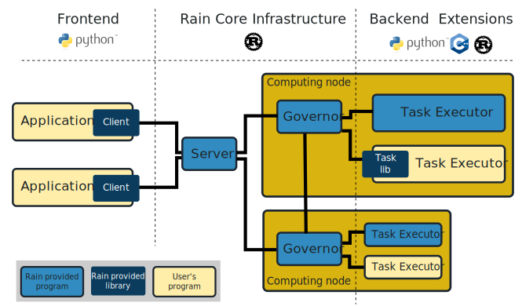

# 可行性报告

# 项目介绍
利用lua脚本语言将一个分布式计算框架rain与时序数据库kungfu结合，搭建一个分布式时序计算平台。
并在此计算平台上模拟运行量化交易程序以检验改造效果。

# 理论依据

## rain的工作原理与使用

我们将从rain的主要构成——rust，rain的特点与使用方法，rain的架构与工作细节三个方面讲解。

### rust的主要特点
Rust是一种系统编程语言，专注于三个目标：安全性、速度和并发性。Rust同样类似于C，是一种静态的强类型系统编程语言，但解决了C广为诟病的安全性问题。

rust还具有以下特点：

+ rustup
  官方提供了一个管理 Rust 版本和相关工具的命令行工具rustup，它方便地为我们提供版本稳定且统一的rust开发工具。

+ cargo
  Cargo 是 Rust 的构建系统和包管理器。使用cargo来管理 Rust 项目十分容易，它替代了make在大型c项目的作用，同时又不需要编写繁复的类似makefile文件来进行代码构建与项目生成。
  
  cargo利用工程目录下的Cargo.toml文件信息来构建项目。Cargo.toml 包含了各类杂项信息如作者，时间，版本等，同时也包含项目构建所必需的信息，如所需的库和依赖。

  在Cargo.toml 中指定所需的库时需要显式地指定库的版本。当搭建项目时发现本地缺乏库或版本不一致时，cargo会自动从官方地址下载获取对应所需的库，而不需手动添加。这使得项目的编译搭建与项目的移植变得容易。同时使用 Cargo 的一个额外的优点是，不管你使用什么操作系统，其命令都是一样的，为跨平台的工作带来便利。

+ 多平台支持
  rust编译支持众多[平台](https://forge.rust-lang.org/platform-support.html)，其中不乏树莓派。rust为跨平台编译也提供了工具链。构建项目时使用target=armv7-unknown-linux-gnueabihf，并配合树莓派官方交叉编译工具链，便可以方便地构建raspbian上运行所需要的格式。

### rain的主要特点
rain是一个分布式计算框架。在表层上，其主要由两个部分组成：一个叫rain的一体化静态链接二进制文件，和一个用于调用rain服务的仅限python的库。前者由rust语言编写而成，rust语言的特点保障了rain工作的安全性、高效性与可靠性，后者由python构成，目的在于能使用户方便快捷地使用此分布式计算框架。

在底层上，rain的二进制文件包含了server，executor与governor三个主要组成部分。其中：

+ server是服务器节点，用于与其他计算节点通信，管理其余计算节点，并进行任务分配与调度，收集计算结果。
+ governor是计算节点的调控管理者，用于与服务器节点通信，接收服务器节点分配的任务与数据，生成executor执行这些任务，并将结果返回给服务器节点。
+ executor是在计算节点由governor生成的用于执行计算任务的部分。rain中内置了部分简单的executor用于简单测试功能（如将两个字符串合并），也支持使用python的通用executor，还提供了rust与c的库，以方便用户编写自己的专用executor。

由于rain将服务器功能与计算节点功能融合进了一个二进制文件中，则目标机器是服务器还是计算节点取决于如何执行rain。执行

    rain start --simple

会将server与governor都部署于本地机器上。执行

     rain start -S --governor-host-file=my_hosts

会将server部署于本地，从my_hosts文件中读取计算节点信息，并使用ssh连接计算节点。执行

    rain governor <SERVER-ADDRESS>

会在本机上启动一个计算节点。它将尝试与server通信，从而接收数据与计算任务。

由于rain本身一体化的设置与便于使用的特性，对其进行使用与部署的便利性大大增强。


### rain的工作原理



当rain部署完成并处于工作状态时，其整体结构如上图所示，rain整体可分为以下三个部分：

+ Client：客户端部分，在这个部分中Client定义多个计算任务任务task，并将task与数据提交给server。
+ Server：服务器部分，此部分中server接收数据与任务，并调度分发给各计算节点；它还负责收取计算结果并集中返回给Client。
+ computing node：计算节点部分，此部分由executor与governor组成。governor生成多个executor执行任务，每个executor会接收task并执行，并返回结果。

task可以由以下几种方式定义：
+ Decorator @remote
  
  当前版本的Rain支持Python的通用executors。这就是 @remote()装饰器的工作原理。它将一个修饰函数序列化为一个数据对象，并创建一个需要执行它的Python执行器的任务。

  一个示例如下：
    ```python
        from rain.client import Client, remote

        @remote()
        def hello(ctx):
            return "Hello world!"

        client = Client("localhost", 7210)

        with client.new_session() as session:
            t = hello()                # Create a task
            t.output.keep()
            session.submit()
            result = t.output.fetch()
            print(result)              # Prints b'Hello world!'
    ```
  此代码中函数hello前有一个@remote()标志，它将hello函数定义为一个task，作用是打印一串字符"hello world!"。
  
  从with语句开始，一个叫t的task被定义，目的是执行hello函数。它被提交并计算，最终获取结果并打印。

    ```python
        @remote()
        def hello(ctx, data1, data2):
            return data1 + data2.get_bytes()
    ```
  此种方式定义的task也可以接受参数与数据，如上所示，但需要遵循rain定义task的一些规则。

+ 自己编写executors

  对于无法以便携方式简单传输代码的语言，Rain提供了tasklibs，一个用于编写专用executors的库。当前版本为C ++和Rust提供了tasklib。tasklib允许创建一个独立的程序，该程序知道如何与调控器通信并提供一组功能。
  
  一个由c编写的示例如下：
    ```c
    #include <tasklib/executor.h>

    int main()
    {
        // Create executor, the argument is the name of the executor
        tasklib::Executor executor("example1");

        // Register task "hello"
        executor.add_task("hello", [](tasklib::Context &ctx, auto &inputs, auto &outputs) {

        // Check that we been called exactly with 1 argument.
        // If not, the error message is set to context
        if (!ctx.check_n_args(1)) {
            return;
        }

        // This is body of our task, in our case, it reads the input data object
        // inserts "Hello" before the input and appends "!"
        auto& input1 = inputs[0];
        std::string str = "Hello " + input1->read_as_string() + "!";

        // Create new data instance and set it as one (and only) result
        // of the task
        outputs.push_back(std::make_unique<tasklib::MemDataInstance>(str);
    });

    // Connect to governor and serve registered tasks
    // This function is never finished.
        executor.start();
    }
    ```
    以上程序编写了一个executors，里面定义了task，名字叫hello，作用是获取字符串，在字符串开头加入"Hello"，结尾加入"!"并将修改过的字符串返回。

    将以上程序按照文档要求编译后部署于计算节点中，则在Client里可以方便地调用executors中提前定义的task，而无需传送python代码给计算节点执行。

+ 调用shell 
  
  Client可以调用计算节点的shell命令作为task，并获取结果返回给计算节点。

  以下为一个例子：
    ```python
    from rain.client import Client, task, Output

    client = Client("localhost", 7210)

    with client.new_session() as session:
        t = tasks.Execute("wget https://github.com/",
                       output_paths=[Output("index", path="index.html")])
        t.output.keep()

        session.submit()
        result = t.output.fetch().get_bytes()
    ```
    接收到任务的计算节点会调用本地shell执行wget命令，并将返回的github网页页面作为输出返回。同理，使用shell也可以再次调用本地程序并获取结果返回。
    

## Lua结合Rain和易筋经

#### 方法一：使用现有模板或API模块

- Lua调用C++

Lua不直接支持将C++类绑定到Lua，但是它提供了一个低级别的C API和扩展机制。利用Lua的C API和Lua的扩展机制可以实现C++在Lua中的调用。实现的方法非常多，从简单的C++模板到功能完善的的API，有很多途径可以实现调用。考虑到本项目中Lua程序和易筋经的交互并不复杂，主要控制其输入和输出，不需要过于强大的API，所以考虑使用一个简单的C++模板，比如[Luna Wrapper](http://lua-users.org/wiki/LunaWrapper)或者扩展后的版本[Luna Five](<http://lua-users.org/wiki/LunaFive>)。

- Lua调用Rust

这里的实现方法相对较少，比较常用的是[rlua](https://github.com/kyren/rlua)，这个库是Rust和Lua之间的高级接口。它的主要目标是在Rust和Lua之间实现尽可能易用、实用和灵活的API，同时又像Rust本身那样安全。由于Lua C API不像Rust那么安全，将其直接使用在Rust程序中容易出现错误，所以rlua不是对于Lua C API的一个简单封装，而是又添加了一些东西来确保安全性，因而不是一个零开销的封装。

#### 方法二：自己写交互代码

上述的已有的接口提供了很多本项目中不需要的功能，如果用在本项目中可能开销较大。如果能掌握Lua与其他语言交互的原理和方法，我们也可以自己来写交互的代码。

Lua和其他语言交互的核心就是Lua栈，所有数据交互都是通过Lua栈来完成的。

实现交互主要有两种途径：

**1.（需要在原C++和Rust程序中添加代码）**

Lua简单地调用C的步骤如下：

- 将C变量或函数(函数原型必须是 int (lua_State*))push到Lua栈中；
- 通过lua_setglobal为当前Lua栈顶的函数或变量命名，这样在Lua中可通过该名字完成对变量或函数的使用；
- 之后可在加载的Lua脚本中使用C变量或函数。

Rust和C++与C的函数调用方法相似，都是利用Lua栈，但是不完全相同，例如，C++中必须有类的对象才能调用成员函数，不仅要传递函数的指针、还要传递对象的指针给Lua。此类问题不难解决，可以参考方法一中的模块中的解决方法。

**2.将原程序封装成动态链接库**

为了保证程序的模块化，最好不要改动原程序，而是自己写一个C++/Rust模块封装原程序，注册函数到Lua解释器中，将原程序编译为动态链接库，然后由Lua去调用这个模块的函数。
    
# 技术依据

# 技术路线

+ 掌握分布式计算框架rain的部署与使用方法，了解其运行原理与特点，并尝试加以改造以适用于本项目。
+ 掌握时序数据库kungfu的部署与使用方法，了解时序数据的特点，掌握此时序数据库的原理与运行方式。
+ 学习lua，一个小巧但强大的脚本语言。lua的易于扩展性可以轻松地将rain与数据库连接起来，使其协同运作。
+ 了解量化交易、高频交易相关知识，理解交易过程产生的时序数据的特点，编写模拟程序用于平台的模拟测试。

# 参考文献

https://github.com/taurusai/kungfu

Michael Durbin.打开高频交易的黑箱[M]. 北京:机械工业出版社, 2013. -.

https://substantic.github.io/rain/docs/
