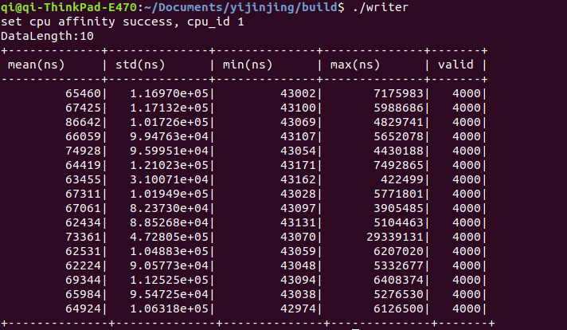
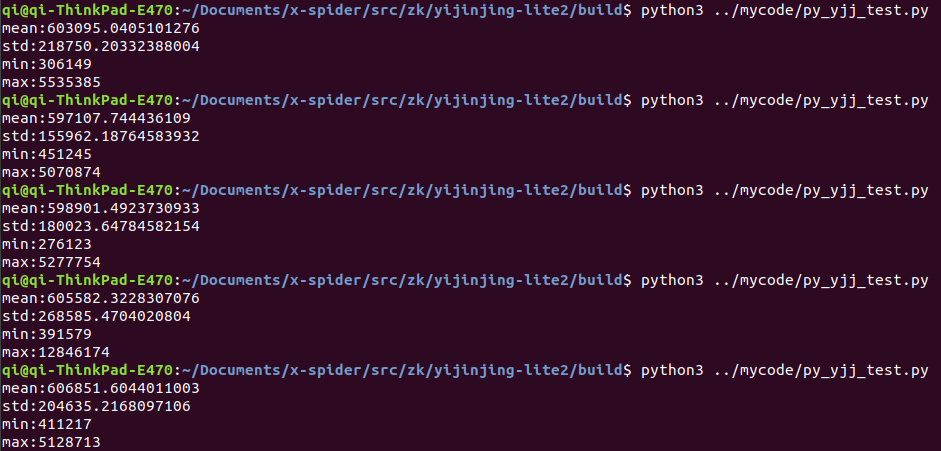
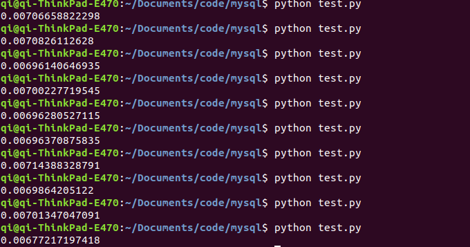

# 结题报告
[1 项目简介](#1-项目简介)
[2 立项依据](#2-立项依据)
## 1 项目简介

本项目搭建了一个分布式时序计算平台，并将该平台应用在了量化交易上。我们将一个分布式计算框架Rain，与一个时序数据库yijinjing结合起来，利用分布式特性实现任务分发，使不同节点监控不同股票，利用时序数据库读写速度极快的特性实现高频量化交易。

## 2 立项依据

时序数据是同一统一指标按时间顺序记录的数据列。在同一数据列中的各个数据是同口径的，具有可比性。时序数据可以是时期数，也可以时点数。时间序列分析的目的是通过找出样本内时间序列的统计特性和发展规律性，构建时间序列模型，进行样本外预测。利用好时序数据可以揭示可操作的趋势，模式，可变性等重要参数。

可见，快速地处理时序数据并从中获取信息可以产生巨大的价值与能量，对时序数据高速有效地处理的需求如今也在逐渐增大。

超级计算在现代科学中发挥着重要的作用，例如天文、化学等很多领域的研究都需要进行繁重的计算任务来模拟行为或者搜索结果。然而，超级计算成本非常高昂，这迫使许多实验只能“从简”，妨碍了科学的发展。

分布式计算是超级计算的一种很好的替代方法。对于一些大型的计算项目，可以由服务器分成很多小的计算任务，分发给与服务器相连的节点，同时计算，再将结果返回，由服务器整合。这样虽然速度比超级计算慢，但相比于传统单机运行，速度大大提升，而且成本较超级计算而言微乎其微。

所以我们使用分布式计算框架Rain结合时序数据库yijinjing搭建分布式时序计算平台。

## 3 环境配置与使用方法

### 3.1 注意事项

本项目有以下事项需要注意：

- 本项目主机与计算节点需要在 `/root`目录下工作，因此需保证主机与节点的root账号均可以使用，且节点允许ssh以root身份登录。

- 数据库的使用需要boost库。在ubuntu下，可以运行以下命令安装所需的库。

  ```
  apt-get install libboost-all-dev
  ```

### 3.2 final文件夹下内容简介

在final文件夹下有以下文件：

- yjj_page_service : 此为yijinjing数据库主体，直接运行后作为一个进程接收写入与读取请求。
- libreader.so libwriter.so : 此为读取写入数据库所提供的功能，以动态库的形式封装。可以使用c++调用，也可以使用python配合ctypes库调用从而对数据库进行读写。
- page_engine.json : 配置文件。配置数据库日志与数据库文件的路径，默认存在`/tmp`下。
- rain : 一个分布式框架，一个二进制文件。用于计算任务的分配，任务的控制运行与结果的收集。
- stock.py : 本次项目中的一个实例项目。此项目监视多支股票，多线程实时获取当前监视的股票数据，异步地将获取的数据存入数据库，通过均线策略分析股票数据，给出买入与卖出的建议。
- spiderfunc.py : 读写数据库所封装的python库。里面集成了数据库的的单条写入，按时间戳单独读出，导出数据库，删除数据库等功能，为用户的使用提供方便。
- libjournal.so	libpaged.so : 数据库使用的辅助二进制动态库。

### 3.3 使用方法

rain可以以server方式启动，此时rain所在机器为主机。也可以governor方式启动，此时rain所在机器为节点。

#### 3.3.1 简单测试

如果想进行简单的测试，则主机与节点在同一台物理机器上，可以按以下方式操作:

1. 将final文件夹下所有内容拷贝至主机下`/root`中。

   ```
   cp final/* /root
   ```

2. 切换目录至```/root```，并使用```--simple```的方式启动rain。以下代码会在本地机器上创建server，并使用本地的一个核作为节点来运行程序。

   ```
   cd /root
   ./rain start --simple
   ```

3. 手动启动数据库。数据库会运行一个进程，监听并接收读写请求。

   ```
    ./yjj_page_service &
   ```

4. 使用python3运行测试stock.py文件。stock.py接受若干参数，其中:

   - `-s <sleep time>`或`--sleep-time=<sleep time>` : 睡眠时间。指定获取数据之间间隔的时间，单位为秒。默认为0.01s。
   - `-t <thread num>`或`--thread-num=<thread num>` : 线程数量。指定多线程获取数据时线程的数量。默认为3。
   - `-c <stock code>`或`--stock-code=<stock code>` : 指定要监听的股票代码。目前测试代码使用的数据来源为新浪股票API。新浪股票API支持从深圳证券交易所与上海证券交易所获取数据。`<stock code>`参数的正确示例如下:

   ```
    sh600000    #从上交所，代码为600000股票获取数据
    sh600001,sh600002   #从上交所获取两支股票，以逗号间隔
    sh123456,sz098765,sh246809  #从深交所，上交所获取三支股票，以逗号间隔
   ```

   以下均为正确运行stock.py的正确示例，python3可换成任意的python3.6解释器 :

   ```
    python3 stock.py -c sh600000
    python3 stock.py -c sh600000,sh600001,sh600002,sh600003 -s 1 
    python3 stock.py --stock-code=sh600000,sh600001,sh600002,sz123456 -s 0.01 -t 4
   ```

如果能正常运行，您将能看到以下结果 :

- 由于无法真实地发出交易信息，所有生成的交易信息保存在了`/root/ans.txt`中。
- 运行过程中，浏览器打开`127.0.0.1:7222`可以监视任务的运行情况。
- page_engine.json文件中指定的目录出现数据库文件。您可以通过一定的方式从中读取。

#### 3.3.2 多机测试

首先对于主机:

1. 将final文件夹下所有内容拷贝至主机下`/root`中。

2. 切换目录至```/root```，以server方式启动rain。有以下两种启动方式。以下方式只会启动主机上的server，需要在节点显式地与主机建立联系。

   ```
    ./rain server &
   # only start server
   ```

   以下方式会在启动主机上server时，通过ssh连接节点，并以governor方式启动节点上的rain，控制节点与主机通信。```<host file name>```为一个文件，一行一个ip。

   ```
   ./rain start --governor-host-file=<host file name>
   # start server, also start governor on other nodes
   ```

对于节点:

1. 将final文件夹下所有内容拷贝至主机下`/root`中。

2. 切换目录至```/root```，若主机只启动了server，按照以下方式显式地连接主机。

   ```
   ./rain governor <server ip> [-p <port>]
   ```

3. 显式地启动节点上的数据库。

   ```
   ./yjj_page_service &
   ```

以上工作完成后，在主机直接运行stock.py文件，运行方式如上所述。

如果能正常运行，您将能看到以下结果 :

- 由于无法真实地发出交易信息，所有生成的交易信息保存在了各个节点的`/root/ans.txt`中。
- 运行过程中，在主机浏览器打开`127.0.0.1:7222`可以监视任务的运行情况。
- 在节点中page_engine.json文件中指定的目录出现数据库文件。您可以通过一定的方式从中读取。

## 4 设计与实现

### 4.1 yijinjing

#### 4.1.1 为什么选择易筋经

市场上主流的数据库，第一优先的核心功能是查询，在海量数据中快速定位到查询的那一条。数据结构在内存中的设计更像是一个巨大的哈希表，这注定相邻数据不会存在连续内存区域，访问和写入数据都存在一定的开销。

而我们这次设计的是面向时间序列的分布式计算平台，数据库部分的目的是在大量时间序列数据输入的情况下，把数据存储下来，便于后续的分析。我们在github上找到了开源项目易筋经数据库。易筋经使用mmap作为底层存储机制，本质上是通过操作系统 kernel 后台进程异步完成内存内容到磁盘文件的同步操作，意味着它赋予了一种在操作内存同时以零延时来操作磁盘文件的能力，使得我们无需担心数据持久化方面的耗时，帮助我们同时完成通信和存储这两个重要任务，这是使用 mmap 方法的精髓所在。

#### 4.1.2 测试写入时间

##### 4.1.2.1 使用C++向yijinjing连续写入1000条数据

使用C++和连续写入的方式可以将数据最快地写入yijinjing数据库。下图是测量连续写入1000条数据的时间，求出4000次测量的均值、方差、最小值、最大值、有效次数，整个测量过程重复10次的结果。可见，写入1000次平均耗时约为70000ns。



##### 4.1.2.2 使用python向yijinjing逐次写入数据

下图是使用python逐次写入yijinjing，求出写入4000条数据的时间的平均值、方差、最小值、最大值。可见，每写入一条数据平均耗时约为0.6ms。



##### 4.1.2.3 使用python向MySQL逐次写入数据

下图是使用python逐次写入MySQL，求出写入4000条数据的时间的平均值。可见，每写入一条数据平均耗时7ms，远大于yijinjing的平均值0.6ms。



由上面三个测试可见，yijinjing数据库的写入速度远远快于常用的MySQL数据库。

#### 4.1.3 接口实现

Rain提供了python的接口，而易筋经本身是用C++编写的，要用Rain调用易筋经，需要编写一些基本接口。我的工作就是设计基本的写入数据，读出数据，打印数据和把数据转化为.csv格式文件的API。

已实现部分：

```
def writeSingleData(data,msgType,jname)
def readSingleData(readtime,jname)
def readSingleMsgType(readtime,jname)
def printAllData(startTime,jname)
def convertAllToCSV(startTime,fileName,jname)
def readCSV(filename,jname)
def deleteJournal(dir,jname)
```

已设计但未实现部分：

```
def expireJournal(journalName)
def initJournal(dir,jname)
def expireJournalByIndex(index,journalName)
```

`data`是数据本体，`msgType`用来标记数据类型，`jname`指定把数据写入到哪一个`Journal`部分。一个`Journal`对应一次写入事件。调用`writeSingleData`时会将数据写入数据库，以二进制文件的形式保存，同时会返回一个时间戳，想要读取数据时可以通过时间戳来读取对应位置的数据或者打印从特定位置开始的所有数据。如果要进行数据的整体分析，提供了`converAllToCSV`接口，将指定Journal内从特定时间开始的数据全部转换为`.csv`格式，便于后续分析。

### 4.2 Rain

### 4.3 拼接

## 5 基于平台实现的应用: 量化交易工具

我们为此项目编写了一个实际应用——一个自动化监视预测交易工具。该应用通过此分布式框架，监视多支股票，多线程实时获取当前监视的股票数据，异步地将获取的数据存入数据库，通过均线策略分析股票数据，给出买入与卖出的建议。

### 5.1 整体架构

stock.py主要包含以下内容:

1. 任务分配: 程序得到用户需要监视的股票池的时候，程序会将这些股票分成若干组，每组5支股票。每一个任务监视一组股票，这样就可以定义若干个任务。任务被提交给rain的任务调度器，由任务调度器根据计算资源利用情况将任务分配给节点，开始分布式地监视股票。
2. 数据获取: 本程序从新浪股票API获取数据。利用线程池并发地获取数据。
3. 数据存取: 通过已经实现的数据库接口，将数据异步地写入磁盘，以便盘后分析。
4. 策略分析: 本项目基于一个简易的策略——均线策略，来进行预测与判断，并生成交易日志。

### 5.2 量化交易简介

量化交易[^1](https://baike.baidu.com/item/量化交易/5266581)是指以先进的数学模型替代人为的主观判断，利用计算机技术从庞大的历史数据中海选能带来超额收益的多种“大概率”事件以制定策略，极大地减少了投资者情绪波动的影响，避免在市场极度狂热或悲观的情况下作出非理性的投资决策。

简单来说，量化交易就是通过一定的预测算法，预测股价走向，并代替人本身进行自动化的买入与卖出。同时由于计算机的参与，其在速度上相比于人工操作也有巨大的优势。

### 5.3 均线策略简介

为实现利益的最大化，优秀的预测模型与策略必不可少。在金融领域，已经产生了大量的模型与策略用于预测，如双均线策略、alpha对冲、日内回转交易、海龟交易法、机器学习等。

本次应用，我们使用了一个简易适合初学者的策略——均线策略。

经典的均线策略如下: 通过比较过去5天收盘平均值与过去20天收盘平均值，获取应执行的交易。如果5日均线大于20日均线，并且该股票当前没有持仓，则买入100手。如果5日均线小于20日均线，则该股票全部卖出。

在本次项目中，若记ma为近几十天平均值。当ma<sub>20</sub>>=ma<sub>5</sub>时认为该股票有下跌趋势，选择将该股票全部抛出，而当ma<sub>20</sub><ma<sub>5</sub>时认为该股票有上涨趋势，购入1 + round((ma<sub>5</sub>-ma<sub>20</sub>)*100)股。在本次测试中，由于我们无法实盘操作，我们暂时没有选择实盘操作，而是选择将交易日志存在本地`/root/ans.txt`。

### 5.4 数据获取

通过python的request库，从新浪财经实时地获取股票价格。为保证效率，使用线程池来实现多线程获取数据。从网页获取的数据格式如下：

获得的股票数据包含开盘价、交易量、竞买价、竞卖价、最高价、最低价、买一卖一报价、时间等大量信息，在本次测试中，我们仅使用股票名称、价格和获取时间。获取数据后，将此次监视股票池内所有股票的数据提交给处理模块。

相比于单线程轮询获取各支股票数据，多线程地获取股票数据有如下优势：

1. 提高系统的吞吐率。多线程编程使得一个进程中可以有多个并发(即同时进行)的操作。例如，当一个线程因为I/O操作而处于等待时，其他线程任然可以执行其操作。
2. 提高响应性。在使用多线程编程情况下，对于GUI软件(如桌面应用程序)而言，一个慢的操作(比如从服务器上下载一个大的文件)并不会导致软件的界面出现被“冻住”的现象而无法响应用户其他的操作；对与Web应用程序而言，一个请求慢了并不会影响其他请求处理。
3. 充分利用多核处理器资源。如今的多核处理器越来越普及，就算是手机这样的消费类设备也普片使用多核处理器。实施恰当的多线程编程有助于我们充分利用多核处理器资源，从而避免资源浪费。
4. 最小化对系统资源的使用。一个进程中的多个线程可以共享其所在进程所申请的资源(如内存空间)，因此使用多个线程相比于使用多个进程进行编程来说，节约了对系统资源的使用。
5. 简化程序的结构。线程可以简化复杂应用程序的结构。

在本次测试中，我们将使用Stock和Worker类来实现多线程数据获取。stock将会在初始化时，实现线程池的初始化，并指定将工作线程获取的数据提交给一个结果队列。此外，Stock还会进行线程的维护，保证所有线程均可正常工作。而每一个Worker实例都属于线程池中一部分，他们将不断执行Stock所提交的任务。待到本机监视的所有股票都从网页获取数据后，将所有结果放入，等待下一步处理。

### 5.5 结果展示

在测试中，我们启动了三个节点，监视若干支股票，并将交易信息存入ans.txt中。

运行时，可以很容易地通过rain 所提供的dashboard来监视节点的运行状况，可以查看到是否出现错误、是否结束运行等信息。

以下为运行过程中的节点状态。

[](https://github.com/OSH-2019/x-spider/blob/master/src/zyy) [](https://github.com/OSH-2019/x-spider/blob/master/src/zyy) [](https://github.com/OSH-2019/x-spider/blob/master/src/zyy) [](https://github.com/OSH-2019/x-spider/blob/master/src/zyy)

运行结束后，可以在指定目录下查看到数据库文件，数据库中存入了这段时间内的股票的所有数据信息。

[](https://github.com/OSH-2019/x-spider/blob/master/src/zyy)

以下为生成的交易信息的一部分。交易信息包含了详细时间、股票名称与买入卖出状态。BUY x表示购买了x单位的股票，SOLD x表示出售了x单位的股票（实际为清仓），WAIT表示什么都不做，继续观察。

```
2019-07-05,14:32:07,包钢股份  SOLD: 4
2019-07-05,14:32:08,中国平安 WAIT
2019-07-05,14:32:09,中原高速 WAIT
2019-07-05,14:32:09,深 赛 格  BUY: 1
2019-07-05,14:32:11,浦发银行  BUY: 1
2019-07-05,14:32:11,包钢股份 WAIT
2019-07-05,14:32:11,中国平安 WAIT
2019-07-05,14:32:12,中原高速 WAIT
2019-07-05,14:32:09,深 赛 格  BUY: 1
2019-07-05,14:32:14,浦发银行  BUY: 1
2019-07-05,14:32:14,包钢股份 WAIT
2019-07-05,14:32:14,中国平安 WAIT
2019-07-05,14:32:12,中原高速 WAIT
2019-07-05,14:32:18,深 赛 格  BUY: 1
2019-07-05,14:32:14,浦发银行  BUY: 1
2019-07-05,14:32:17,包钢股份 WAIT
2019-07-05,14:32:15,中国平安 WAIT
2019-07-05,14:32:15,中原高速 WAIT
2019-07-05,14:32:18,深 赛 格  BUY: 1
2019-07-05,14:32:17,浦发银行  BUY: 1
2019-07-05,14:32:17,包钢股份 WAIT
2019-07-05,14:32:17,中国平安 WAIT
2019-07-05,14:32:18,中原高速 WAIT
2019-07-05,14:32:21,深 赛 格  BUY: 1
2019-07-05,14:32:17,浦发银行  SOLD: 8
2019-07-05,14:32:20,包钢股份 WAIT
2019-07-05,14:32:17,中国平安 WAIT
2019-07-05,14:32:18,中原高速 WAIT
2019-07-05,14:32:24,深 赛 格  SOLD: 14
2019-07-05,14:32:20,浦发银行 WAIT
2019-07-05,14:32:23,包钢股份 WAIT
```

## 6 改进、展望与总结

### 6.1 目前项目存在的问题

1. rain分布式计算框架本身只提供python API，只能支持分发使用python编写的计算任务，泛用性不强。同时由于python进程与数据库进程间通讯方式单一，大量C支持的通讯方式（如消息队列，共享内存等）python均不支持，python与数据库交互速度仍不够快，交互过程不够优雅，存取数据时对实时性的影响较大，未能充分利用数据库实时性强的特点。
2. 数据库本身将实时性做到极致，但数据库易用性和功能性上仍有需要改进的地方。其功能相对单一，使用较为复杂，因此此项目所能提供的功能也极为有限。
3. 项目本身与用户的交互性不好。在量化交易中，用户只能通过dashboard查看节点运行状态，而无法获取节点所发出的具体交易信息，削弱了用户本身对交易状态的掌控。

### 6.2 展望与总结

我们希望能使用功能更加全面的分布式框架，对本项目进行改造。我们希望能对分布式计算能有更多的了解，从而能在现有基础上对框架进行改造，以提高项目本身的耦合性与泛用性以及效率。
