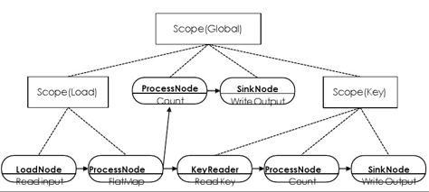
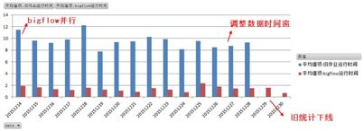
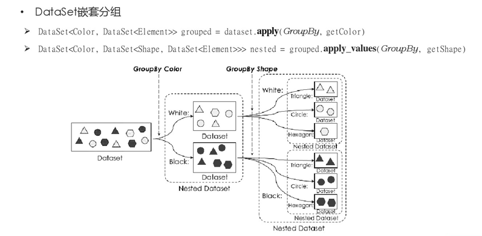

- [IoT设备的算力利用](#iot设备的算力利用)
    - [1 小组成员](#1-小组成员)
    - [2 项目简介](#2-项目简介)
    - [3 立项依据](#3-立项依据)
        - [3.1 超级计算成本高昂](#31-超级计算成本高昂)
        - [3.2 物联网设备算力丰富](#32-物联网设备算力丰富)
        - [3.3 现有分布式计算框架的局限性](#33-现有分布式计算框架的局限性)
        - [3.4 Rain的优势](#34-rain的优势)
        - [3.5 Rain的缺陷](#35-rain的缺陷)
    - [4 项目目标](#4-项目目标)
    - [5 项目背景](#5-项目背景)
        - [5.1 分布式计算](#51-分布式计算)
            - [5.1.1 什么是分布式计算](#511-什么是分布式计算)
            - [5.1.2 分布式计算的发展](#512-分布式计算的发展)
            - [5.1.3 分布式计算的现状](#513-分布式计算的现状)
        - [5.2 Rain](#52-rain)
            - [5.2.1 概述](#521-概述)
            - [5.2.2 内部结构](#522-内部结构)
            - [5.2.3 Rain的基础设施](#523-rain的基础设施)
            - [5.2.4 Python_Client](#524-python_client)
            - [5.2.5 简单实例](#525-简单实例)
        - [5.3 物联网技术](#53-物联网技术)
            - [5.3.1 物联网简介](#531-物联网简介)
            - [5.3.2 物联网的潜力](#532-物联网的潜力)
        - [5.4 Rust](#54-rust)
            - [5.4.1 简介](#541-简介)
            - [5.4.2 特点](#542-特点)
            - [5.4.3 优势](#543-优势)
            - [5.4.4 原则](#544-原则)
            - [5.4.5 设计来源](#545-设计来源)
        - [5.5 裸机编程](#55-裸机编程)
    - [6 前瞻性和重要性](#6-前瞻性和重要性)
    - [7 相关工作](#7-相关工作)
        - [7.1 MapReduce](#71-mapreduce)
        - [7.2 Apache Spark](#72-apache-spark)
            - [7.2.1 简介](#721-简介)
            - [7.2.2 Spark运行的基本流程](#722-spark运行的基本流程)
            - [7.2.3 Spark的计算流程](#723-spark的计算流程)
        - [7.3 Apache Storm](#73-apache-storm)
        - [7.4 Pregel](#74-pregel)
        - [7.5 Baidu Bigflow](#75-baidu-bigflow)
        - [7.6 BOINC](#76-boinc)
        - [Inferno](#inferno)
    - [参考文献](#参考文献)


# IoT设备的算力利用


## 1 小组成员
队长：詹佑翊

队员：曹宇昂 万琪 琚泽谦 张衎


## 2 项目简介

本项目旨在将[Rain](https://github.com/substantic/rain)（一个开源的Rust语言编写的分布式计算框架）从Linux系统移植到raspbian系统上，使树莓派成为分布式计算节点，能够接收、执行和返回服务器分发的计算任务；缩减和优化Rain代码，使其更加轻量、快速，并且能够长期在树莓派的后台运行，不影响其他运行在树莓派上的程序，以此实现对以树莓派为代表的物联网设备的闲置算力的有效利用。如果时间允许，还将尝试对Rain进行裸机编程的改造，提高Rain的运行速度，同时使Rain适用于更多物联网设备。


## 3 立项依据

### 3.1 超级计算成本高昂

超级计算在现代科学中发挥着重要的作用，例如天文、化学、生物医药等领域的许多研究都需要进行繁重的计算任务来模拟行为或者搜索结果。然而，超级计算成本高昂，当前最快的超级计算机 IBM Summit supercomputer 花费2亿美元建造，中国的天河二号造价高达25亿人民币，每日电费约60万元。有人估算，一个持续半年的天文物理模拟项目，如果使用中国的超级计算机来计算，要缴纳的费用高达百万元，这迫使许多实验只能”从简“，妨碍了科学的发展。

分布式计算是超级计算的一种很好的替代方法。对于许多时效性要求不高、数据交换不频繁的计算项目，可以由服务器分成很多小的计算任务，分发给很多松散连接的小型设备，同时计算，再将结果返回，由服务器整合。这样虽然速度比超级计算慢，但相比于传统单机运行，速度大大提升，而且成本较超级计算而言微乎其微。分布式计算在电脑上的应用已经比较成熟，但在更小型的设备上很少应用，尤其是物联网设备，虽然单个设备性能较差，但是它们数量众多，具有很高的利用价值。


### 3.2 物联网设备算力丰富

目前全世界的联网设备数量已经超过170亿，扣除智能手机、平板电脑、笔记本电脑或固定电话等连接之外，物联网设备的数量达到70亿，而且增速仍在加快。物联网设备几乎无处不在，从家家户户的智能电视，到公共场所的面部识别设备，自助服务设备等等，它们数量众多，可以联网，并具有一定的算力，但是大量的设备长时间处于闲置状态。例如常见的自动售卖机，每天24小时开机，但是发挥功能的时间远远少于等待的时间，其具备的算力没有得到充分利用，反而造成对电力的浪费。如果能集中大量物联网设备的闲置算力，解决计算密集型的问题，将会大大降低许多项目的计算成本，节约大量资源和财力。

树莓派也属于物联网设备，它采用ARM架构，不同于大多数电脑。树莓派除了受到极客和计算机学习者的广泛使用，还在商业领域得到越来越多的应用，例如定制的树莓派可以打造成视频会议系统、智能家居系统和无人机系统等等。树莓派的总销售量已突破2300万台，具有巨大的算力资源。因此在我们的研究中，将以树莓派作为物联网设备的代表，作为我们的实验平台。


### 3.3 现有分布式计算框架的局限性

目前存在一些分布式的志愿计算的平台，将大型计算项目提交到平台上，就有很多人用自己的电脑从平台上接收计算任务，自愿地为这些研究项目贡献一些闲置的算力。其中最流行的一个平台是BOINC（伯克利开放式网络计算平台），功能比较完善，但是我们并没有选择这个平台作为实验的对象，原因有三：

* BOINC比较庞大，安装在电脑上是合适的，但对于内存很小、算力有限的物联网设备而言，会拖慢和干扰设备原本执行的任务。
* BOINC比较复杂，对于想用它来创建自己的计算项目的人、以及想要为这个开源软件提供改进的开发人员而言，比较困难。
* BOINC使用C/C++语言，尽管C/C++是当前最流行的系统编程语言，但在内存管理等方面存在着许多弊病，使用不够安全和方便；新兴的系统编程语言Rust能很好地替代C/C++，Rust具有C/C++的几乎所有优点，同时更加安全稳健。

因为上述原因，我们把目光投向一个小众的开源分布式计算平台——Rain。


### 3.4 Rain的优势 

Rain是一个Rust语言编写的分布式计算框架，尽管仍处于早期版本，但它已经具备基础的功能。在安装了Rain的不同电脑上，可以设置其中一台电脑为服务器，分发和整合计算任务，其余电脑可以接收并处理任务。Rain具有以下优势：

* Rain是轻量的框架，功能精简，安装方便，占用内存很小，对系统要求很低，适合移植到物联网设备上。
* Rain的主体使用Rust语言，得益于Rust语言的先进优势，Rain兼具简洁和安全的特点。
* Rain向用户提供Python接口，只要会用Python语言写程序，就可以将自己的程序分成小的计算任务利用Rain进行分布式计算，这降低了使用分布式计算的门槛。

鉴于以上的优点，我们选择Rain作为我们研究和改进的对象，计划用Rain来实现对物联网设备算力的利用。


### 3.5 Rain的缺陷

Rain的开发时间比较短，还存在不少需要完善的地方，想要把Rain部署到物联网设备上，我们要解决以下几个问题：

* Rain只支持Linux/x64系统。

* Rain目前是一个运行在前台的程序，开始运行后就要与其他程序争夺系统资源，这不符合我们要利用闲置算力的目的。

* Rain将服务器和计算节点的代码合在一起，集成在一个程序中，而对于内存和算力较小的物联网设备而言，根本没有必要具备服务器的功能，这样反而占用了更多内存，而且拖慢了运行速度。

* Rain的功能实现依赖于操作系统，但是大部分物联网设备不像树莓派那样有较完备的操作系统，往往只有具有少量功能的定制系统或者根本没有操作系统，在这些设备上Rain很难正常工作。

  

## 4 项目目标

本项目的目标是让Rain成为一个跨平台的轻量分布式计算框架，能够充分利用物联网设备的闲置算力。

具体的目标是：

* 用Rust语言对Rain代码做修改，让Rain能够运行在使用raspbian系统的ARM架构的树莓派上。
* 让Rain使用CPU的优先级最低，不影响设备的其他功能。
* 把Rain的代码中用于计算节点的部分抽取出来，在树莓派上运行，使程序更加精简，减少所需的内存空间，提高运行速度。
* 如果实现上述目标之后，还有充分的时间，就尝试对Rain做裸机编程的改造，在Rain和硬件之间只有一层硬件适配层，没有操作系统。如果能够实现，会提高Rain的运行效率，并且说明Rain具备应用于更多类型的物联网设备的潜力。


## 5 项目背景


### 5.1 分布式计算

#### 5.1.1 什么是分布式计算

分布式计算是计算机科学中一个研究分布式系统的领域，是利用互联网上的计算机的中央处理器的闲置处理能力来解决大型计算问题的一种计算科学。

随着计算机的普及，个人电脑开始进入千家万户。与之伴随产生的是电脑的利用问题。越来越多的电脑处于闲置状态，即使在开机状态下中央处理器的潜力也远远不能被完全利用。互联网的出现, 使得连接调用所有这些拥有限制计算资源的计算机系统成为了现实。

一些本身非常复杂的但是却很适合于划分为大量的更小的计算片断的问题被提出来，交给分布式计算中的服务端（server），服务端将这些小的计算部分分配给联网参与的客户端（client），客户端对其进行处理，处理的结果通过网络发送给服务端，服务端将结果汇总，得到最终的结果。目前一些较大的分布式计算项目的处理能力已经可以达到甚而超过目前世界上速度最快的巨型计算机。

#### 5.1.2 分布式计算的发展

二十世纪六十年代末问世的阿帕网（ARPANET）是互联网的前身，阿帕网电子邮件在七十年代初问世，它可能是大规模分布式应用的最早的例子，进入二十世纪九十年代，因特网迅速地商业化。商业利用也极大地推进了因特网的发展。在此背景下，计算形式也从传统的集中计算到分时计算，直到出现分布式计算、并行计算等。

九十年代志愿计算（分布式计算）逐渐普及，到1999年SETI@HOME在全球范围内利用了联网PC的力量以解决CPU密集型问题。

2000年以来，出现了很多优秀的分布式计算框架，2004年Google公布了部分MapReduce实现的细节，受此启发的Doug Cutting等人用2年的时间实现了DFS和MapReduce机制，这便是Hadoop项目。2005年Hadoop被正式引入Apache基金会，2006年成为一套完整独立的软件。Apache Spark 是专为大规模数据处理而设计的快速通用的计算引擎，是加州大学伯克利分校的AMPlab所开源的类Hadoop MapReduce的通用并行框架，该框架于2009年问世，2010年正式开源，2013年成为Apache基金会的项目。Apache Storm是一个分布式的、高容错的实时计算系统，2010年Storm核心概念被提出，2011年Storm正式问世，2013年Storm成为Apache的开源项目，2014年步入顶尖开源行列。

#### 5.1.3 分布式计算的现状

在过去全球的各种分布式计算已有很多，这些计算大多互无联系、独立使用自己的一套软件。这种分布式计算互相割据的格局很不利于发展的需要。比如，某个生物学研究机构需要利用世界各地志愿者的计算机来模拟蛋白质折叠的过程，那个生物学研究机构没有分布式计算方面的专业人才，而社会上也并没有任何公司可以提供这样的服务，他们就不得不自己花费大量精力用于开发分布式计算的服务器、客户端。这样一来，原来可以用于研究生物的时间用在了别的地方。刚才提到的生物学研究机构就是美国斯坦福大学的PANDE小组。

为了改变这种杂乱无章的割据，加州大学伯克利分校（UC Berkeley）首先提出了建立BOINC的想法。BOINC（Berkeley Open Infrastructure for Network Computing）的中文全称是伯克利开放式网络计算平台，他能够把许多不同的分布式计算项目联系起来统一管理。并对计算机资源进行统一分配（比方您对研究艾滋病药物和探索地外文明同时感兴趣，您就可以同时选择两个运行，并设置优先级）。对统计评分系统进行统一管理（无论你在为哪个项目工作，只要你奉献CPU时间长，就积分高）。有了这样的统一管理，的确给PANDE小组这样的科学研究机构提供了便利！

主要运行于集群上的主流分布式计算框架有Spark，Storm等等，许多IT公司的分布式计算平台都是基于它们或者在它们的基础上做了修改而得到的。
但是看似强大的计算机系统，实际上很多地方都比人类世界要脆弱得多。特别是在分布式计算机集群系统中，如下几个方面很容易出现问题：

- 节点之间的网络通信是不可靠的，包括消息延迟、乱序和内容错误等；
- 节点的处理时间无法保障，结果可能出现错误，甚至节点自身可能发生宕机；
- 同步调用可以简化设计，但会严重降低分布式系统的可扩展性，甚至使其退化为单点系统。
  这些问题也是分布式领域亟待解决的难题。


### 5.2 Rain

#### 5.2.1 概述

[Rain](https://github.com/substantic/rain)是一种用于大规模基于任务的管道的开源分布式计算框架。尽管此项目仍处于早期版本，但它仍是一个功能齐全的项目。RAIN旨在降低进入分布式计算世界的门槛，它的目的是提供一个轻量级但是依然健壮的分布式框架，该框架具有直观的python API、简单的安装和部署，以及深入的监控。具体来说，此分布式计算框架有以下特点：

- 数据流编程。Rain中的计算被定义为任务的流程图。任务可以是内置函数，Python代码或外部应用程序，短而轻或长时间运行和繁重。该系统旨在将任何代码集成到管道中，尊重其资源需求，并处理非常大的任务图（数十万个任务）。
- 使用方便。Rain的设计易于部署，从单节点部署到大规模分布式系统。
- Rust核心，Python API。为了安全和高效，Rain用Rust编写，并为Rain核心基础架构提供了高级Python API，甚至支持开箱即用的Python任务。
- Python/C++/Rust。Rain中的任务提供了一种在Python，C++和Rust中定义用户定义任务的方法。
- 监控。使用项目本身提供的dashboard，Rain支持在线与事后监控。


#### 5.2.2 内部结构

Rain基础设施由中央服务器组件（server)和调控器组件(governor)组成，它们可以在不同的机器上运行。调控器可以生成一个或多个执行器，这些执行器是提供外部代码执行的本地进程。Rain由python executor分配。Rain还为C++和Rust提供了编写专用执行器的库。

用户通过客户端应用程序与服务器交互。rain是通过python客户机API分发的。


#### 5.2.3 Rain的基础设施

- 基于内部任务间依赖关系的基本调度启发式方法。
- Rust实施使构建、部署和变得容易，运行可靠。
- 以一体式二进制形式分发。
- governor和governor之间的直接沟通。
- 执行监控的基本仪表盘。

#### 5.2.4 Python_Client

- 基于任务的编程模型。
- 与Rain核心基础设施的高级接口。
- 轻松定义各种类型的任务及其相互依赖关系。
- 基于Python3模块。
- 代码在客户端运行，创建会话和任务图，执行和查询会话。在那里，任务只被创建和声明，从未实际执行过。
- 在管理器上的远程python任务中运行的python代码。此代码可以访问实际的输入数据，但只能看到相邻的数据对象（输入和输出）。

#### 5.2.5 简单实例

rain将计算表示为任务和数据对象的图形。在图形构建过程中，任务并不急于执行。相反，实际执行是在显式提交之后由RAIN基础设施管理的。这将导致一个编程模型，在该模型中，您首先只定义一个图，然后执行它。

```
from rain.client import Client, tasks, blob

client = Client("localhost", 7210)  # Create a connection to the server
                                    # running at localhost:7210

with client.new_session() as session:  # Creates a session

    a = blob("Hello ")    # Create a definition of data object in the current session
    b = blob("world!")    # Create a definition of data object in the current session
    tasks.Concat([a, b])  # Create a task definition in the current session
                          # that concatenates input data objects

    session.submit()      # Send the created graph into the server, where the computation
                          # is performed.
    session.wait_all()    # Wait until all submitted tasks are completed
```

会话中的图表如下所示：


### 5.3 物联网技术

#### 5.3.1 物联网简介

广义看来，任何具有开/关开关的设备连接到Internet都属于物联网（Internt of Things）的一部分，包括手机、咖啡机、洗衣机、耳机、台灯、可穿戴设备，甚至包括机器的部件，例如飞机的喷气发动机或石油钻机的钻机。

#### 5.3.2 物联网的潜力

根据分析公司Gartner表示，到2020年，全球将有超过260亿部联网设备。物联网是一个巨大的“物联网”(也包括人)网络。关系将是人与人、人与物、物与物之间的关系。如果我们可以将这些设备的算力加以利用，哪怕单个设备算力相对匮乏或是我们只能利用其中一部分，庞大的数量仍能保证了惊人的计算资源。


### 5.4 Rust

#### 5.4.1 简介

Rust最初是由Mozilla员工Graydon Hoare作为个人项目设计和开发的。Mozilla从2009年开始赞助这个项目，并在2010年正式宣布。第一个稳定的版本Rust 1.0在2015年5月15日发布。

Rust是一种系统编程语言，专注于三个目标：安全性、速度和并发性。

Rust是免费的开源软件，即任何人都可以自由使用软件，而且源代码是公开共享的，人们可以改进软件的设计。

在2016年、2017年和2018年的stack overflow开发者调查中，Rust被评为“最受喜爱的编程语言”之一。

#### 5.4.2 特点

Rust是非常年轻和非常现代的语言。它是一种编译编程语言（compiled programming 
language），后端使用LLVM。另外，Rust是一种多范式编程语言，它支持命令式过程、并发参与者、面向对象和纯函数风格。它还支持静态和动态样式的泛型编程和元编程。

Rust最独特和引人注目的特性之一是所有权（Ownership），它用于实现内存安全性。Rust开放地创建内存指针，使用引用和借用（References and Borrowing）检查编译时内存指针的有限访问,通过检查生存期（Lifetimes）来自动执行编译时的内存管理。

Rust的语法类似于C++语言。

#### 5.4.3 优势

Rust是一种静态的强类型系统编程语言。

**静态**意味着所有类型在编译时都是已知的。

**强类型**的设计使得编写不正确的程序更加困难，因而编译一旦成功，就对正确性有了很好的保证。

**系统**意味着在完全控制内存使用的情况下生成尽可能好的机器码。所以它的用途非常硬核，主要有操作系统、设备驱动程序以及甚至可能没有操作系统的嵌入式系统。

然而，它也是一种非常适合编写普通应用程序代码的语言。与C和C++的最大区别在于，Rust在默认情况下是安全的，它检查所有的内存访问，意外损坏内存是不可能的。

#### 5.4.4 原则

Rust体现的原则包括:

- 严格执行对数据安全借用
- 用函数、方法和闭包对数据进行操作
- 用元组、结构体和枚举体来聚合数据
- 用于模式匹配来选择和分解数据
- 用特征来定义数据上的行为

#### 5.4.5 设计来源

它的设计元素来源广泛：

- Abstract Machine Model: C
- Data types: C, SML, OCaml, Lisp, Limbo
- Optional Bindings: Swift
- Hygienic Macros: Scheme
- Functional Programming: Haskell, OCaml, F#
- Attributes: ECMA-335
- Memory Model and Memory Management: C++, ML Kit, Cyclone
- Type Classes: Haskell
- Crate: Assembly in the ECMA-335 CLI model
- Channels and Concurrency: Newsqueak, Alef, Limbo
- Message passing and Thread failure: Erlang


### 5.5 裸机编程

“裸机编程”是指没有各种抽象层的编程，或者像一些人所说的没有操作系统的编程。应用程序是裸机实现中唯一运行在处理器上的软件。选择用裸机架构来绕过操作系统，基于裸机打造一套存储定制的软件堆栈，而将硬件访问，任务调度，事件处理，多核同步，这几个原本需要OS来主导的环节省去了。

相比于应用运行在操作系统上，对于一个相当简单的应用程序，操作系统会消耗更多的资源，比如RAM、flash等。因此，选择裸机框架可以大大提升性能。其中，最直接的好处是IOPS和延迟表现的很大提升。

本次大作业中我们将尝试实现越过树莓派操作系统，将rain直接部署在裸机上，以实现树莓派算力的充分利用。


## 6 前瞻性和重要性

本项目的愿景是让物联网设备丰富的算力通过Rain这个平台得到充分利用。

现在，物联网设备几乎无处不在，随着科技的发展，在未来，智能家居、智能办公、自动汽车等会得到越来越广泛的应用，物联网设备将越来越多。它们的算力如果能被充分利用，将产生巨大的经济和社会效益。试想，如果全世界的物联网设备加入到分布式计算的网络中，在闲置时贡献算力用于宇宙探索、药物开发、研究气候变化等等，计算成本将大大降低，既节约了资源，同时又推动科技的发展。

至于Rain使用的Rust语言，虽然现在使用还不广泛，但它比C/C++更先进，未来必定会有更多人使用Rust语言，像Rain这样的使用Rust语言的开源项目会吸引更多的开发人员。


## 7 相关工作

### 7.1 MapReduce
MapReduce是Hadoop框架中的一个编程模型或模式，用于访问存储在Hadoop文件系统(HDFS)中的大数据。

使用MapReduce，不是将数据发送到应用程序或逻辑所在的位置，而是在数据已经所在的服务器上执行逻辑，以加快处理速度。

**MapReduce是如何工作的**:

MapReduce的核心是两个功能:Map和Reduce。 Map函数将磁盘中的输入作为<key，值>对，处理它们，并生成另一组中间<key，值>对作为输出。Reduce函数还将输入作为<key，值>对，并生成<key，值>对作为输出。
输入数据首先被分割成更小的块。然后将每个块分配给一个mapper进行处理。这期间均经历以下过程：

+ Combine：一个可选过程。combiner是一个在每个mapper服务器上单独运行的reducer。它将每个mapper上的数据进一步简化为简化形式，然后再传递给下游。这使得洗牌和排序更容易，因为要处理的数据更少。

+ Partition：将mapper生成的<key、值>对转换为另一组<key、值>对以提供给reducer的过程。它决定如何将数据呈现给reducer，并将其分配给特定的reducer。

+ Reduce：在所有mapper完成处理之后，框架在对结果进行排序再传递给reducer。当映射程序还在进行中时，reducer不能启动。所有具有相同key的映射输出值都分配给一个单一的reducer，然后该reducer聚合该key的值。MapReduce是Hadoop框架中的一个编程模型或模式，用于访问存储在Hadoop文件系统(HDFS)中的大数据。


### 7.2 Apache Spark
#### 7.2.1 简介

Apache Spark是一个开源分布式计算框架，最初是由加州大学伯克利分校AMPLab所开发。

Spark的核心是RDD（Resilient Distributed Datasets），即弹性分布式数据集。它是对数据的高度抽象概念，弹性可理解为数据存储弹性（可存储在内存，也可存储在磁盘）; 分布式可理解为数据分布在不同节点。RDD是分布式数据的逻辑抽象，物理数据存储在不同的节点上，但对用户透明。

它具有以下特点：

- 执行速度极快：首先它支持将计算任务的中间结果放在内存中而不是HDFS上，这样可以加快速度，根据评测最高可以提升100倍。
- 支持多种运行模式：除了可以独立在集群上执行任务以外，Spark还支持将任务执行在EC2或Apache Hadoop的YARN上，也可以从HDFS、Cassandra、HBase、Hive等。各种数据存储系统中读取数据。
- 更多更通用的计算模型：I-ladoop只提供了较为底层的MapReduce模型，编程人员往往需要大量编码来解决简单的任务。而spark则提供了SQL接口、APachespark流模型接口、MLib机器学习接口以及GraphX图形计算接口等多种接口，可以方便应用于多种场合，提高开发人员的开发效率。

#### 7.2.2 Spark运行的基本流程

1.构建Spark Application的运行环境（启动SparkContext），SparkContext向资源管理器（可以是Standalone、Mesos或YARN）注册并申请运行Executor资源。

2.资源管理器分配Executor资源并启动StandaloneExecutorBackend，Executor运行情况将随着心跳发送到资源管理器上。

3.SparkContext构建成DAG图，将DAG图分解成Stage，并把Taskset发送给Task Scheduler。Executor向SparkContext申请Task，Task Scheduler将Task发放给Executor运行同时SparkContext将应用程序代码发放给Executor。

4.Task在Executor上运行，运行完毕释放所有资源。


#### 7.2.3 Spark的计算流程

1.Spark内核会在需要计算发生的时刻绘制一张关于计算路径的有向无环图（DAG）。

2.将DAG划分为Stage

Spark Application中可以因为不同的Action触发众多的job，一个Application中可以有很多的job，每个job是由一个或者多个Stage构成的，后面的Stage依赖于前面的Stage，也就是说只有前面依赖的Stage计算完毕后，后面的Stage才会运行。

核心算法：从后往前回溯，遇到窄依赖加入本stage，遇见宽依赖进行Stage切分。Spark内核会从触发Action操作的那个RDD开始从后往前推，首先会为最后一个RDD创建一个stage，然后继续倒推，如果发现对某个RDD是宽依赖，那么就会将宽依赖的那个RDD创建一个新的stage，那个RDD就是新的stage的最后一个RDD。然后依次类推，继续继续倒推，根据窄依赖或者宽依赖进行stage的划分，直到所有的RDD全部遍历完成为止。


3.提交Stages

DAGScheduler通过TaskScheduler接口提交任务集，这个任务集最终会触发TaskScheduler构建一个TaskSetManager的实例来管理这个任务集的生命周期，对于DAGScheduler来说，提交调度阶段的工作到此就完成了。而TaskScheduler则会在得到计算资源的时候，进一步通过TaskSetManager调度具体的任务到对应的Executor节点上进行运算。

4.监控Job、Task、Executor

DAGScheduler监控Job与Task：要保证相互依赖的作业调度阶段能够得到顺利的调度执行，DAGScheduler需要监控当前作业调度阶段乃至任务的完成情况。这通过对外暴露一系列的回调函数来实现的，对于TaskScheduler来说，这些回调函数主要包括任务的开始结束失败、任务集的失败，DAGScheduler根据这些任务的生命周期信息进一步维护作业和调度阶段的状态信息。

DAGScheduler监控Executor的生命状态：TaskScheduler通过回调函数通知DAGScheduler具体的Executor的生命状态，如果某一个Executor崩溃了，则对应的调度阶段任务集的ShuffleMapTask的输出结果也将标志为不可用，这将导致对应任务集状态的变更，进而重新执行相关计算任务，以获取丢失的相关据。

5.获取任务执行结果

一个具体的任务在Executor中执行完毕后，其结果需要以某种形式返回给DAGScheduler，根据任务类型的不同，任务结果的返回方式也不同。

结果共有两种，分别是中间结果与最终结果：对于FinalStage所对应的任务，返回给DAGScheduler的是运算结果本身，而对于中间调度阶段对应的任务ShuffleMapTask，返回给DAGScheduler的是一个MapStatus里的相关存储信息，而非结果本身，这些存储位置信息将作为下一个调度阶段的任务获取输入数据的依据。

### 7.3 Apache Storm
Apache storm是一个开源的、实时的计算平台，最初由社交分析公司Backtype的NathanMarz编写，后来被Twitter收购，并作为开源软件发布。从整体架构上看，Apache Storm和Hadoop非常类似。Apache Storm从架构基础本身就实现了实时计算和数据处理保序的功能，而且从概念上看，Apache Storm秉承了许多Hadoop的概念、术语和操作方法。
Apache Storm作为实时处理系统中的一个典型案例，其特点和优势如下。
+ 高可扩展性：Apache Storm可以每秒处理海量消息请求，同时该系统也极易扩展，
只需增加机器并提高计算拓扑的并行程度即可。根据官方数据，在包含10个节点的Apache Storm集群中可以每秒处理一百万个消息请求，由此可以看出Apache Storm的实时处理性能优越。
+ 高容错性：如果在消息处理过程中出现了异常，Apache Storm的消息源会重新发送相关元组数据，确保请求被重新处理。
+ 易于管理：Apache Storm使用Zookeeper来协调集群内的节点配置并扩展集群规模。
+ 消息可靠性：Apache Storm能够确保所有到达计算拓扑的消息都能被处理。


### 7.4 Pregel
Pregel在概念模型上遵循BSP模型。整个计算过程由若干顺序运行的超级步（Super Step）组成，系统从一个“超级步”迈向下一个“超级步”，直到达到算法的终止条件  

Pregel在编程模型上遵循以图节点为中心的模式，在超级步S中。每一个图节点能够汇总从超级步S-1中其它节点传递过来的消息，改变图节点自身的状态。并向其它节点发送消息。这些消息经过同步后。会在超级步S+1中被其它节点接收并做出处理。用户仅仅须要自己定义一个针对图节点的计算函数F(vertex)，用来实现上述的图节点计算功能。至于其它的任务，比方任务分配、任务管理、系统容错等都交由Pregel系统来实现。典型的Pregel计算由图信息输入、图初始化操作，以及由全局同步点分割开的连续运行的超级步组成，最后可将计算结果进行输出。

每一个节点有两种状态：活跃与不活跃，刚开始计算的时候，每一个节点都处于活跃状态，随着计算的进行，某些节点完毕计算任务转为不活跃状态，假设处于不活跃状态的节点接收到新的消息，则再次转为活跃，假设图中全部的节点都处于不活跃状态，则计算任务完毕，Pregel输出计算结果。


### 7.5 Baidu Bigflow
Baidu Bigflow是百度的一套计算框架，它致力于提供一套简单易用的接口来描述用户的计算任务，并使同一套代码可以运行在不同的执行引擎之上。用户基本可以不去关心Bigflow的计算真正运行在哪里，可以像写一个单机的程序一样写出自己的逻辑， Bigflow会将这些计算分发到相应的执行引擎之上执行。



+ 目的：
使分布式程序写起来更简单，测起来更方便，跑起来更高效，维护起来更容易，迁移起来成本更小。
+ 特性：
   + **高性能**  
Bigflow的所有的计算均为惰性求值，能够看到尽可能大的计算过程并进行关键参数的自动优化。另其执行层使用C++实现，用户的一些代码逻辑会被翻译为C++执行，有较大的性能提升。根据百度公司内部的实际业务测试来看，Bigflow性能远高于用户手写的作业。平均来说，通过现有业务改写过来的作业平均，其性能都比原用户代码提升了100%+。



   + **易于使用**  
Bigflow的接口表面看起来很像Spark，但实际使用后会发现Bigflow使用一些独特的设计使得Bigflow的代码更像是单机程序，例如，屏蔽了partitioner的概念，支持嵌套的分布式数据集等，使得其接口更加易于理解，并且拥有更强的代码可复用性。



   + **支持python**  
Bigflow目前原生支持的语言是Python，因此克服了PySpark中的低效率，不支持某些CPython库或一些功能仅在Scala和Java中可用，而在PySpark中暂时处于不可用状态的缺点，从而在性能、功能、易用性等方面都对Python用户比较友好。

### 7.6 BOINC

BOINC(Berkeley Open Infrastructure for Network Computing)是伯克利开放式网络计算平台，由美国加州大学伯克利分校所开发，开发的目的是为了帮助研究人员更方便地获得分布在世界各地的志愿者的计算资源。 

BOINC是一个比较成熟的软件，它已经应用在了各种大型项目上(如SETI@home)。BOINC已经实现了利用树莓派的算力，它可以安装在Raspbian上，让世界各地空闲的树莓派可以为大型的分布式计算项目贡献算力。

### Inferno

Inferno是一个可以创造并支持分布式服务的操作系统。它主要是基于贝尔实验室九号项目的经验以及贝尔实验室接下来对于操作系统、语言等的研究而产生的。

Inferno是基于九号项目的三个基础原则而制作的分布式操作系统：

- 把资源视做文件：把所有的资源都列在层次结构式文件系统中以文件表示。
- 名字空间：从应用程序的观点来看，网络是种单一且清楚的名字空间，能展现层次结构式文件系统，也能代表近端或远程实体分离的资源。
- 标准通信协议：采用名为Styx的标准协议，用来访问近端或远程的所有资源。

Inferno具有几个方面上的可移植性与通用性：

- 可以移植到不同的处理器上：当前可以在ARM、MIPS、PA-RISC、PowerPC、SPARC，以及x86等架构上运作，也可以移植到其他的架构上。
- 可以移植到不同的环境上：它可以以独立的操作系统运作在小型终端机上，或是以用户应用软件的形式存在于九号项目、Windows NT、Windows 95、UNIX（Irix、Solaris、FreeBSD、GNU/Linux、AIX、HP-UX）。Inferno应用程序在这些环境中都有相同的接口。
- 分布式设计：在用户终端机以及服务器的部分都具有相同的环境，而且彼此间可以导入对方的资源（例如附加的输入/输出设备或是网络）。应用程序可以在运行系统中的通信机制辅助之下，轻松的（甚至是动态的）分散到客户端或服务端。

Styx协议将Inferno系统的各个独立的命名空间粘合了起来，Inferno内核实现了一个mount driver，它将文件系统操作转换为远程过程调用，以便通过网络传输。在网络的另一端，服务器解包Styx的消息并使用本地资源实现它们。因此，可以实现从其他机器导入资源​。


## 参考文献
https://www.javatpoint.com/rust-tutorial

https://stevedonovan.github.io/rust-gentle-intro/

https://learning-rust.github.io/docs/a1.why_rust.html

https://searchdatacenter.techtarget.com/definition/grid-computing

https://www.talend.com/resources/what-is-mapreduce/

https://stanford.edu/~rezab/classes/cme323/S15/notes/lec8.pdf

https://baidu.github.io/bigflow/zh/index.html

卢誉声.分布式实时处理系统：原理、架构与实现[M].机械工业出版社:北京,2016.6:2-14.

https://www.forbes.com/sites/jacobmorgan/2014/05/13/simple-explanation-internet-things-that-anyone-can-understand/#14bf2c7f1d09  《A Simple Explanation Of 'The Internet Of Things'》

https://elib.dlr.de/110774/ 《Bare Metal Porting of Tasking Framework on a Xilinx Board》

https://www.doit.com.cn/p/256968.html
