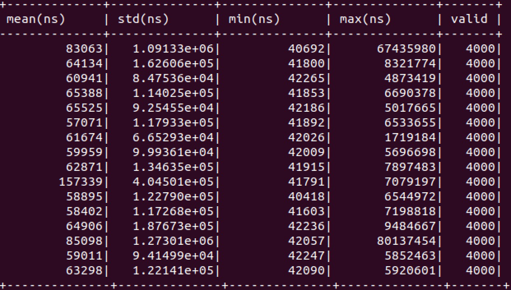
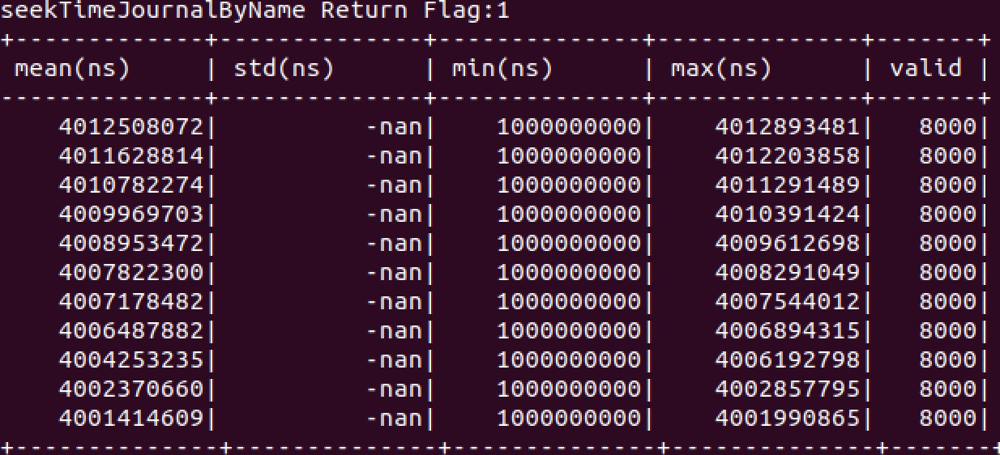

# 易筋经数据库的连接

## 为什么选择易筋经

​	市场上主流的数据库，第一优先的核心功能是查询，在海量数据中快速定位到查询的那一条。数据结构在内存中的设计更像是一个巨大的哈希表，这注定相邻数据不会存在连续内存区域，访问和写入数据都存在一定的开销。

​	而我们这次设计的是面向时间序列的分布式计算平台，数据库部分的目的是在大量时间序列数据输入的情况下，把数据存储下来，便于后续的分析。我们在github上找到了开源项目易筋经数据库。易筋经使用mmap作为底层存储机制，本质上是通过操作系统 kernel 后台进程异步完成内存内容到磁盘文件的同步操作，意味着它赋予了一种在操作内存同时以零延时来操作磁盘文件的能力，使得我们无需担心数据持久化方面的耗时，帮助我们同时完成通信和存储这两个重要任务，这是使用 mmap 方法的精髓所在。

## 环境配置

​	在ubuntu下，安装boost库。

## 接口实现

​	Rain提供了python的接口，而易筋经本身是用C++编写的，要用Rain调用易筋经，需要编写一些基本接口。我的工作就是设计基本的写入数据，读出数据，打印数据和把数据转化为.csv格式文件的API。

已实现部分：

```python
def writeSingleData(data,msgType,jname)
def readSingleData(readtime,jname)
def readSingleMsgType(readtime,jname)
def printAllData(startTime,jname)
def convertAllToCSV(startTime,fileName,jname)
def readCSV(filename,jname)
def deleteJournal(dir,jname)
```

已设计但未实现部分：

```python
def expireJournal(journalName)
def initJournal(dir,jname)
def expireJournalByIndex(index,journalName)
```

​	data是数据本体，msgType用来标记数据类型，jname指定把数据写入到哪一个Journal部分。一个journal对应一次写入事件。调用writeSingleData时会将数据写入数据库，以二进制文件的形式保存，同时会返回一个时间戳，想要读取数据时可以通过时间戳来读取对应位置的数据或者打印从特定位置开始的所有数据。如果要进行数据的整体分析，提供了converAllToCSV接口，将指定Journal内从特定时间开始的数据全部转换为.csv格式，便于后续分析。

## 测试过程

易筋经数据库的写入速度：



读取数据速度：




## mmap

​	mmap是一种内存映射文件的方法，将文件映射到进程的虚拟地址空间，实现文件磁盘地址和进程虚拟地址空间一一对应的关系。这样，进程可以采用指针的方式读写这一段内存，不必调用open,write等系统调用函数，也实现了不同进程间的文件共享。

​	mmap可以减少一次内存拷贝，平时使用的write/open函数，文件内容的拷贝要多经历内核缓冲区这个阶段，因而mmap可以大大提高性能。